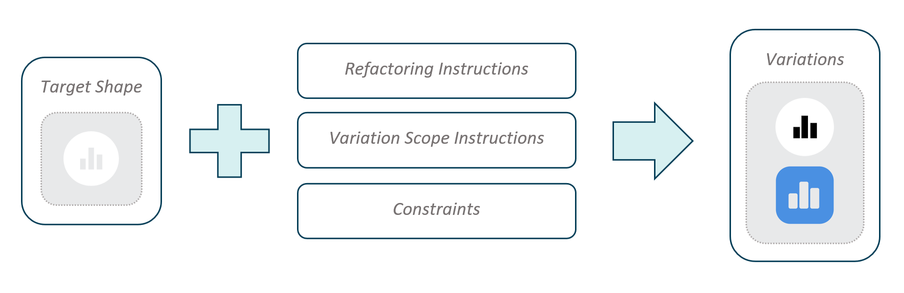
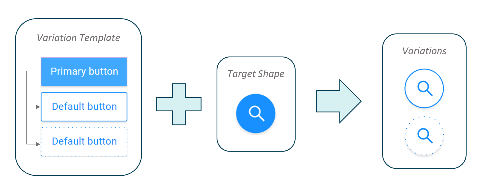
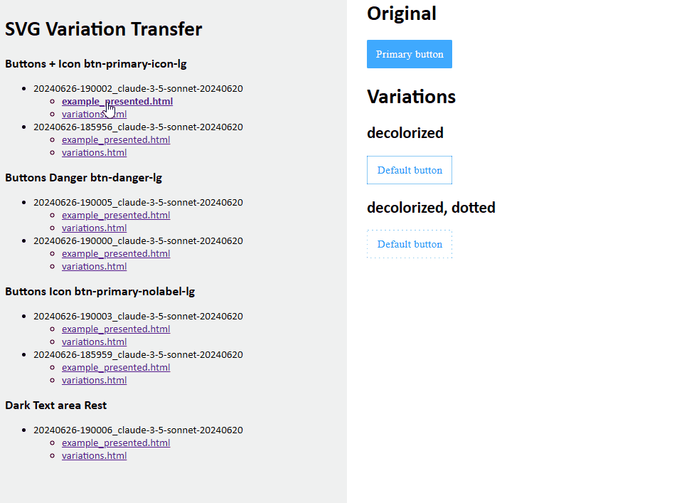
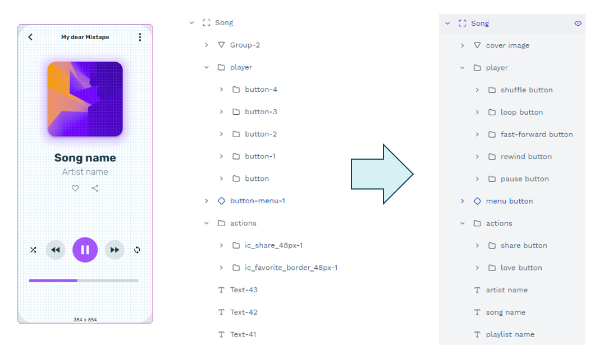
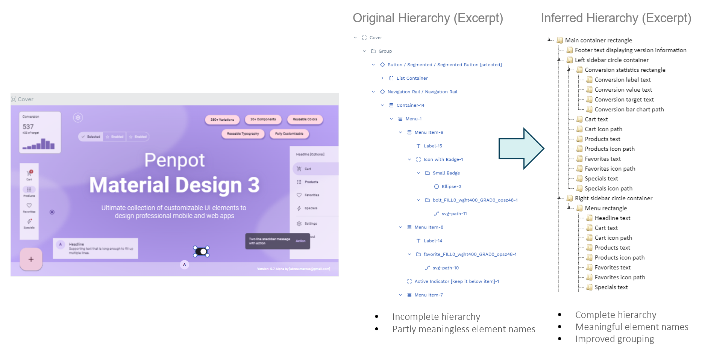

# Generative AI Capabilities for Penpot

This project explores applications of generative AI in the context of [Penpot](https://penpot.app),
an open-source design and prototyping platform.

While some of the capabilities are specific to Penpot, the project also aims to provide general 
functionality for the generation and augmentation of design assets provided in standard formats 
such as SVG.

<!-- generated with `markdown-toc -i README.md` -->
***Table of Contents***

<!-- toc -->

- [Use Cases](#use-cases)
  * [Generating Variations of Vector Shapes](#generating-variations-of-vector-shapes)
  * [Variation Style Transfer](#variation-style-transfer)
  * [Naming Shapes Semantically](#naming-shapes-semantically)
  * [Hierarchy Inference](#hierarchy-inference)
- [Development Environment](#development-environment)
  * [Python Virtual Environment](#python-virtual-environment)
  * [Docker Setup](#docker-setup)
  * [Codespaces](#codespaces)
  * [Secrets, Configuration and Credentials](#secrets-configuration-and-credentials)

<!-- tocstop -->

## Use Cases

Our use cases build upon state-of-the-art large language models/vision language models.
Particularly Anthropic's *Claude 3.5 Sonnet* model proved to have a solid understanding of vector
graphics and is therefore the model of choice for most our use cases.

### Generating Variations of Vector Shapes



### Variation Style Transfer

In user interface design, the same principles are often applied to a wide variety of
UI elements and other shapes, e.g. in order to indicate different UI states such as 
'hover', 'focus', or 'disabled'.

Given a template indicating how a given UI element is transformed, the task is to apply
the same transformation to a different shape:



Here are some results we obtained with Claude 3.5, showing the presented template
and subsequently the applied transformation:



Entry point: [scripts/batch_variation_transfer.py](scripts/batch_svg_variation_transfer.py)
Result visualisation: via [web server](scripts/web_server.py)

### Naming Shapes Semantically

Associating shapes with meaningful names can be essential for discoverability, especially
in large design projects.
We thus consider the problem of finding meaningful names for an existing hierarchy of shapes:



### Hierarchy Inference

In larger projects, shapes may be grouped suboptimally.
We consider the problem of jointly inferring an updated hierarchy and naming the shapes contained:




## Development Environment

Clone the repository and run

```shell
git submodule update --init --recursive
```

to also pull the git submodules.

### Python Virtual Environment

Create a Python 3.11 environment and install the dependencies with

```shell
poetry install --with dev
```

### Docker Setup

Build the docker image with

```shell
docker build -t penai .
```

and run it with the repository mounted as a volume:

```shell
docker run -it --rm -v "$(pwd)":/workspaces penai
```

You can also just run `bash docker_build_and_run.sh`, which will do both things
for you.

Note: When using the Windows subsystem for Linux (WSL), you might need to adjust the path for the
volume.

### Codespaces

The fastest way to get running without any installation is to use GitHub 
Codespaces. The repository has been set up to provide a fully functioning
Codespace with everything installed out of the box. You can either
paste your `config_local.json` file there or pass the secrets as env vars
when the codespace is created by using the `New with options` button:


### Secrets, Configuration and Credentials

For pulling data or interacting with VLM providers, you will need secrets that
are to be
stored in the git-ignored file `config_local.json`. Please contact the project
maintainers
for the file's contents.

After adding the secrets and installing the dependencies, every script and
notebook
can be executed on any machine. The first execution will pull missing data from
the
remote storage, and hence might take a while, depending on what data is missing.
