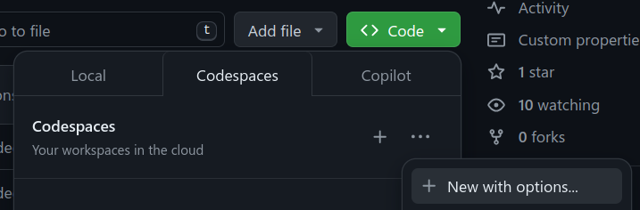

# penai

Welcome to the penai project.

## Getting Started

Clone the repository and run

```shell
git submodule update --init --recursive
```

to also pull the git submodules.

### Python setup

You can install the dependencies with

```shell
poetry install --with dev
```

### Docker setup

Build the docker image with

```shell
docker build -t penai .
```

and run it with the repository mounted as a volume:

```shell
docker run -it --rm -v "$(pwd)":/workspace penai
```

You can also just run `bash docker_build_and_run.sh`, which will do both things
for you.

Note: for the WSL subsystem on Windows you might need to adjust the path for the
volume.

### Codespaces

The fastest way to get running without any installation is to use GitHub 
Codespaces. The repository has been set up to provide a fully functioning
Codespace with everything installed out of the box. You can either
paste your `config_local.json` file there or pass the secrets as env vars
when the codespace is created by using the `New with options` button:



## Secrets, Configuration and Credentials

For pulling data or interacting with VLM providers, you will need secrets that
are to be
stored in the git-ignored file `config_local.json`. Please contact the project
maintainers
for the file's contents.

After adding the secrets and installing the dependencies, every script and
notebook
can be executed on any machine. The first execution will pull missing data from
the
remote storage, and hence might take a while, depending on what data is missing.
